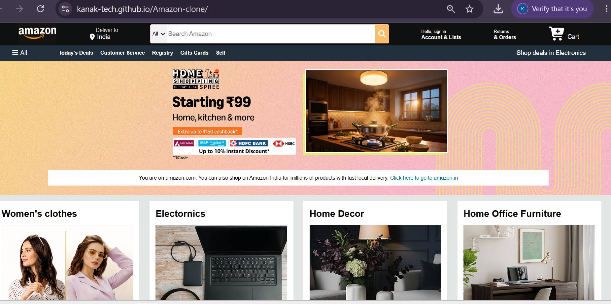

# Amazon Clone

A responsive Amazon homepage clone built using HTML and CSS. This project replicates the basic user interface of Amazon, including the navigation bar, search section, hero banner, product categories, and footer.

## Preview

## Features

* Responsive Navigation Bar
* Search Box with Icon
* Location and Cart Section
* Hero Banner Section
* Product Category Cards
* Footer with Multiple Sections
* Hover Effects
* Clean and Structured Layout

## Technologies Used

* HTML5
* CSS3
* Font Awesome

## Learning Outcomes

Through this project, I improved my understanding of:

* HTML page structure
* CSS styling and layouts
* Flexbox
* Responsive design fundamentals
* Hover effects and UI development
* Building real-world website interfaces

## Project Structure

amazon-clone/
│
├── index.html
├── style.css
├── images/
└── README.md

## Future Improvements

* Mobile Responsive Design
* Product Search Functionality
* JavaScript Interactivity
* Improved Product Cards
* Enhanced User Experience

## Live Demo

https://kanak-tech.github.io/Amazon-clone/

## Author

Kanak Prajapati

Computer Science Student | Java | DSA | Web Development
